# SistemaMultiagente_SDLC

AI-assisted SDLC framework con governance enterprise, SDD y enfoque brownfield-first.

> BMAD orquesta; SistemaMultiagente_SDLC orquesta y verifica.

## Why

This project installs a governed multi-agent SDLC into greenfield or legacy repos. It combines reusable agent personas, OpenSpec/SDD workflows, phase gates, migrations, validators, rollback and optional persistent memory.

The operating model is SDD waterfall by slice and agile by release: each slice has explicit requirements, readiness, design, implementation, verification and archive gates, while releases can stay iterative.

## Quick Start

Published package flow (>=1.2.1):

```powershell
# Desde la raíz del repo destino (cwd = repo).
# --target es opcional desde v1.2.1: si se omite, se usa el directorio actual.
npx sistema-multiagente-sdlc init --mode greenfield --project-name "My Project"

# Smoke previo sin escribir nada:
npx sistema-multiagente-sdlc init --mode greenfield --project-name "My Project" --dry-run --json
```

Para v1.2.0 (compatibilidad), el comando equivalente requería `--target` explícito:

```powershell
npx sistema-multiagente-sdlc@1.2.0 init --target . --mode greenfield --project-name "My Project"
```

Local development flow:

```powershell
git clone https://github.com/JuanCastrejon/SistemaMultiagente_SDLC.git
cd SistemaMultiagente_SDLC
corepack prepare pnpm@11.3.0 --activate
pnpm install --frozen-lockfile
pnpm run validate
pnpm test
node ./bin/sdlc.js install --target ../my-project --mode greenfield --project-name "My Project"
```

Legacy/brownfield:

```powershell
node ./bin/sdlc.js install --target ../legacy-project --mode legacy --project-name "Legacy Project"
node ./bin/sdlc.js doctor --target ../legacy-project --json
```

## Runtime Multiagente

Desde `1.4.0`, `sdlc` incluye comandos ejecutables para continuidad cross-IDE. El runtime primario es Node; los wrappers PowerShell solo existen para ergonomia Windows.

```powershell
sdlc session-start --target . --json
sdlc resume --target . --markdown
sdlc save --target . --event manual --json
sdlc continua --target . --platform codex --json
sdlc memory-sync --target . --mode health --json
sdlc validate-runtime --target . --json
sdlc hooks install --target . --post-merge-checkpoint --json
```

Reglas base:

- `session-start` crea `.sdlc/session.json` con healthcheck de Headroom, CodeGraph, Graphify, caveman, vault y slice actual.
- `resume` es solo lectura y recompone contexto en orden repo -> CodeGraph -> Graphify -> vault.
- `save` escribe checkpoints locales en el vault; no promueve GitHub Issues, OpenSpec ni PRs sin gate humano.
- `hooks install --post-merge-checkpoint` instala un hook local `post-merge` que ejecuta `sdlc save --event post-merge`.
- `memory-sync --mode nightly --apply` importa chats y exporta Graphify al vault; no crea checkpoints automaticos.

## Harness Ejecutable F0-F17

Desde `1.5.0`, el flujo F0-F17 tiene contrato ejecutable y evidencia por fase.

```powershell
sdlc phase-gate --target . --phase F5 --slice <slice> --json
sdlc governance-check --target . --json
sdlc tools-doctor --target . --profile full --json
sdlc pr-body-check --repo . --pr <number> --json
```

Reglas base:

- `phase-contract.yaml` declara owner, participantes, entradas, salidas, gate humano y siguiente fase.
- `.github/agent-state/evidence/<slice>/<phase>.yaml` registra evidencia trazable cuando la fase lo exige.
- `governance-check` compara el bloque `SDLC_SHARED_RULES` entre IDEs y valida mirrors de skills.
- `tools-doctor --profile full` reporta el stack de harness completo: OpenSpec, Graphify, CodeGraph, Obsidian, Headroom, Caveman, autoskills, Vercel skills, party-mode y pnpm.

 
## Modes

| Mode | Use when | Adds |
| --- | --- | --- |
| `greenfield` | new repo or clean product start | greenfield SDD templates and governance |
| `legacy` | existing repo, migration or brownfield modernization | mandatory research templates and legacy discovery gates |

## Agents

| Plane | Personas |
| --- | --- |
| Control | `planificador-opus`, `orquestador-opus` |
| Product/coordination | `product-owner-agent`, `project-manager-agent` |
| Definition | `analista-requisitos`, `arquitecto-modular-clean`, `qa-test-architect-agent` |
| Specialist | `api-nestjs`, `web-admin`, `mobile-sync`, `ux-designer-agent`, `tech-writer-agent` |
| Gate | `qa-security-review` |

## Phase Flow

```mermaid
flowchart LR
  F0["F0 Bootstrap"] --> F1["F1 Requirements"]
  F1 --> F2["F2 Human draft review"]
  F2 --> F3["F3 Local issue"]
  F3 --> F35["F3.5 Branch"]
  F35 --> F4["F4 Readiness handoff"]
  F4 --> F5["F5 SDD planning"]
  F5 --> F6["F6 Planner handoff"]
  F6 --> F7["F7 Orchestration"]
  F7 --> F8["F8 Implementation"]
  F8 --> F9["F9 QA"]
  F9 --> F10["F10 Security"]
  F10 --> F11["F11 Commit"]
  F11 --> F12["F12 PR"]
  F12 --> F13["F13 Human gate"]
  F13 --> F14["F14 Merge"]
  F14 --> F15["F15 Verify"]
  F15 --> F16["F16 Archive"]
  F16 --> F17["F17 Docs + trace"]
```



## Validators

`pnpm run validate` runs the framework validators:

- config schema
- no personal paths
- template sanitization
- no inline managed content
- manifest integrity
- no placeholder scripts
- external tools policy
- governance precedence
- skill manifest consistency
- agent persona schema
- docs links exist
- OpenSpec consistency
- Mustache references exist
- models schema

## Optional External Tools

See `templates/docs/agents/external-tools-matrix.md` for setup details.

| Tool | Required | Purpose |
| --- | --- | --- |
| OpenSpec | yes | SDD specs, changes and archive |
| Graphify | no | structural graph for fast orientation |
| Obsidian | no | local persistent memory vault |
| caveman | no | token-saving communication mode |
| gh CLI | yes for GitHub publish | issues, PRs and releases |

All external installs are opt-in. Scripts default to dry-run or local-only behavior unless `-Apply` or another explicit install flag is provided.

## BMAD Comparison

Side-by-side de los dos frameworks. La intención no es competir sino aclarar dónde se solapan y dónde cada uno se especializa. Datos de BMAD tomados de su README oficial v6 (`bmad-code-org/BMAD-METHOD`, npm `bmad-method`).
| Feature | BMAD-METHOD v6 | SistemaMultiagente_SDLC v1.5.0 |
| --- | --- | --- |
| License | MIT | MIT |
| Runtime requisitos | Node ≥20.12, Python ≥3.10, `uv` | Node ≥22.13, PowerShell (pwsh/powershell), Git |
| Install command | `npx bmad-method install` (interactive) o `--yes --modules --tools` (CI) | `npx sistema-multiagente-sdlc init` (cwd default desde v1.2.1) |
| Scope principal | AI-driven agile development | AI-assisted SDLC con governance enterprise y SDD |
| Workflows | 34+ agile workflows (BMM core) | SDD waterfall por slice + agile por release (F0-F17 phases) |
| Scale-adaptive | sí, automático (bug → enterprise) | scale hint activo desde v1.3.0 |
| Agentes/personas | 12+ personas (PM, Architect, Dev, UX, …) | 8 personas activas + roadmap extensible |
| Party / collaboration mode | yes (multiple personas en sesión) | roundtable opt-in planned v1.3.0 |
| Help CLI / next-step coach | `bmad-help` skill | `sdlc doctor` (state checks); `sdlc next` planned v1.3.0 |
| Modules / ecosystem | BMM (core) + BMB (builder) + TEA (test architect) + BMGD (game dev) + CIS (creative) | mode-based (`greenfield` / `legacy`) + extensible packs planned v2.0.0 |
| Skills architecture | sí (V6 + Sub-Agent inclusion + Cross-Platform Agent Team) | skills mirroring across `.claude/`, `.agents/`, `.windsurf/` (`bootstrap-agent-skills.ps1`) |
| Custom agent/workflow builder | BMad Builder v1 | personas `.agent.md` + validators (`validate-agent-persona-schema`) |
| Dev Loop automation | en roadmap V6 | `phase-graph.yaml` + rework label-driven + lock TTL |
| Brownfield-first | no | sí (legacy mode con research obligatorio antes de proposal) |
| Governance validators | not core | 14 validators (config, personal-paths, template-sanitization, manifest-integrity, governance-precedence, …) |
| OpenSpec / SDD | not core | integrated (capacidades canónicas en `openspec/specs/`) |
| Readiness L1/L2/L3 + matriz NFR | not core | integrated (`business-production-readiness` spec) |
| Migration system + rollback | not core | backup automático + `sdlc upgrade --to-version` + `sdlc rollback --to <id>` |
| Multi-agent lock | not core | TTL `platform-context.json` lock |
| Sanitization de paths/templates | not core | `validate:no-personal-paths` + `validate:template-sanitization` |
| Provenance (SLSA) | n/d explícito | sí, SLSA v1 + signatures vía OIDC GitHub (workflow `publish.yml`) |
| Community | Discord abierto, YouTube, X | GitHub Issues + Discussions (Discord no necesario) |
| Trademark | BMad / BMAD-METHOD trademarks of BMad Code, LLC | sin restricción explícita más allá de MIT |

Lectura corta: BMAD lidera en agile breadth y community (12+ personas, 34+ workflows, 5 módulos, Discord activo, Skills Architecture V6). SistemaMultiagente_SDLC lidera en governance + brownfield + SDD + validators (14) + migration system + readiness L1/L2/L3 + sanitization. Ambos pueden coexistir: BMAD orquesta; SistemaMultiagente_SDLC orquesta **y verifica**.

## Roadmap

v1.3.0:

- bash parity for critical scripts
- `sdlc next`
- adaptive scale: bug, feature, epic, platform
- calibration extensions
- roundtable opt-in
- docs site
- regression-install matrix: agregar `macos-latest` (triple coverage ubuntu + windows + macos)
- bump `actions/checkout@v5` + `actions/setup-node@v5` con `node-version: 24`; deadline GitHub: Node 20 deprecated jun 2026, removed sep 2026

v2.0.0:

- extensible packs
- plugin API
- marketplace registry
- English i18n
- interactive contextual help

## Contributing

Read `CONTRIBUTING.md`, `CODE_OF_CONDUCT.md` and `SECURITY.md`.

## License

MIT.
