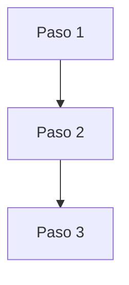
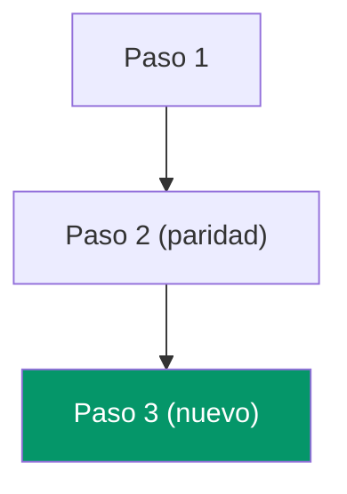
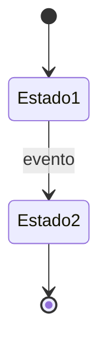

## Problem Statement

<!-- En 2-3 oraciones: qué problema resuelve este cambio, para quién y por qué ahora.
     Formato: "[Rol/stakeholder] necesita [capacidad] porque [problema/oportunidad].
     Sin esto, [consecuencia concreta]." -->

## Stakeholders afectados

| Rol | Persona / cargo | Impacto | Valida |
|---|---|---|---|
| <!-- rol del sistema --> | <!-- nombre o cargo --> | <!-- bajo/medio/alto --> | <!-- sí/no --> |

## Objetivo del cambio

<!-- Qué se quiere resolver o habilitar y por qué importa ahora -->

## Objetivo de negocio

<!-- Qué necesidad de negocio o riesgo operativo resuelve este cambio -->

## Hipótesis de valor

<!-- Por qué este cambio debería generar valor o reducir un riesgo -->

## KPI principal

<!-- Qué métrica se quiere mover, con línea base y objetivo cuando existan -->

## Fuentes revisadas

<!-- Lista explícita de specs, docs, tablas, pantallas o runtime inspeccionado -->

## Estado actual observado

<!-- Hallazgos confirmados con evidencia -->

## Proceso AS-IS

<!-- Diagrama Mermaid del flujo actual en el legacy (si aplica).
     Si el cambio no altera un flujo existente, marcar "N/A — capacidad nueva sin flujo legacy". -->

## Proceso TO-BE (propuesto)

<!-- Diagrama Mermaid del flujo esperado en el sistema nuevo post-cambio.
     Marcar en color los nodos nuevos vs los que mantienen paridad. -->

## Diagrama de estados (si aplica)

<!-- Para entidades con lifecycle (documentos, órdenes, permisos, etc.).
     Si no aplica, eliminar esta sección del research final. -->

## Reglas de negocio detectadas

<!-- Extraer y listar reglas identificadas durante la investigación.
     Estas reglas deben catalogarse también en docs/domain/reglas-negocio-catalogo.md -->

| ID | Regla | Módulo(s) | Tipo | Fuente | Estado |
|---|---|---|---|---|---|
| <!-- RN-XXX --> | <!-- descripción --> | <!-- módulo --> | <!-- general/cliente/dominio/operativa --> | <!-- archivo:línea --> | <!-- vigente/pendiente-validación --> |

## Perfil de readiness

<!-- Clasificar el cambio como L1, L2 o L3 y justificar por qué -->

## Matriz NFR

| Concern | Expectativa | Evidencia esperada |
|---|---|---|
| Seguridad | <!-- ... --> | <!-- ... --> |
| Performance / concurrencia | <!-- ... --> | <!-- ... --> |
| Disponibilidad | <!-- ... --> | <!-- ... --> |
| Observabilidad | <!-- ... --> | <!-- ... --> |
| Rollback | <!-- ... --> | <!-- ... --> |
| Datos / compliance | <!-- ... --> | <!-- ... --> |
| Costo | <!-- ... --> | <!-- ... --> |

## Plan operativo inicial

<!-- Owner operativo, despliegue/cutover, rollback y validaciones esperadas -->

## Feedback post-release

<!-- Ventana de seguimiento, KPI observado y criterio para retrabajo -->

## Drift / restricciones

<!-- Diferencias entre fuentes, límites del cliente, errores heredados, huecos -->

## Alcance propuesto

<!-- Qué entra en este cambio y qué queda fuera -->

## Capacidades candidatas

<!-- Capacidades OpenSpec nuevas o existentes que este cambio tocará -->

## Preguntas abiertas

<!-- Decisiones o vacíos que deben resolverse antes o durante la implementación -->
